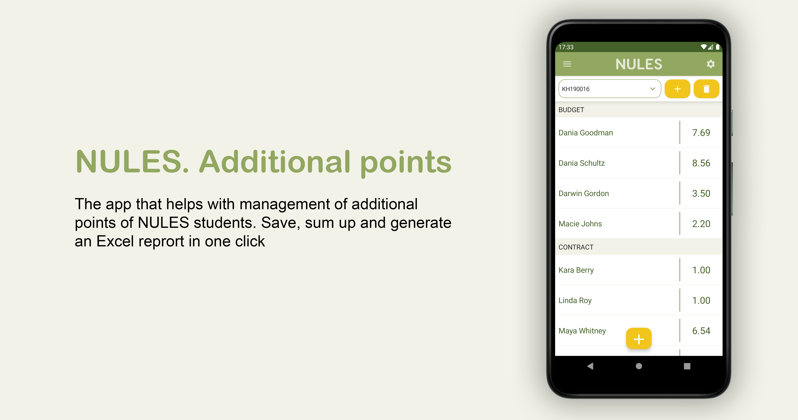
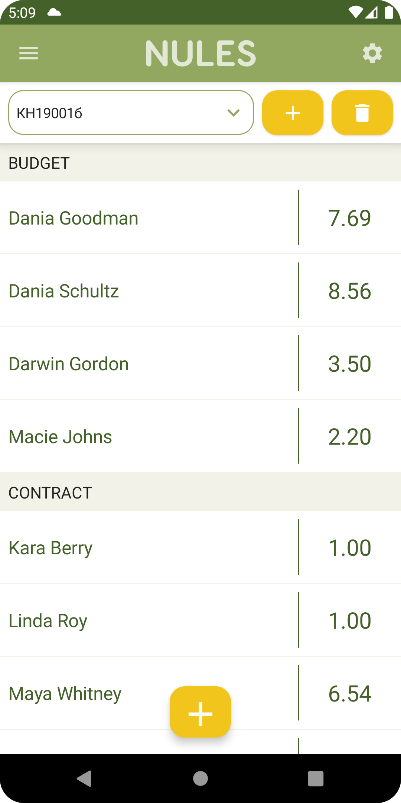
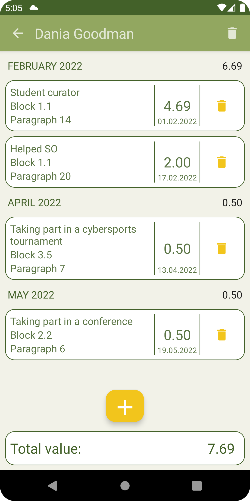
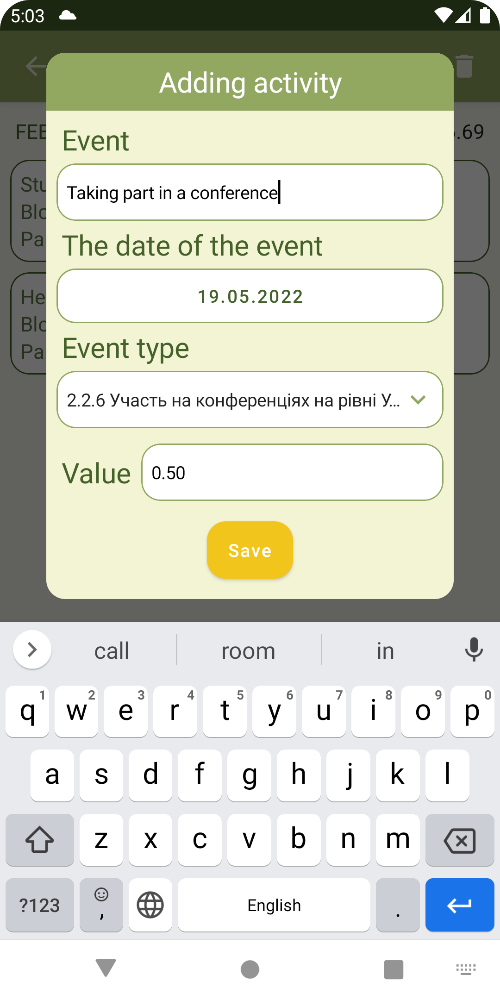
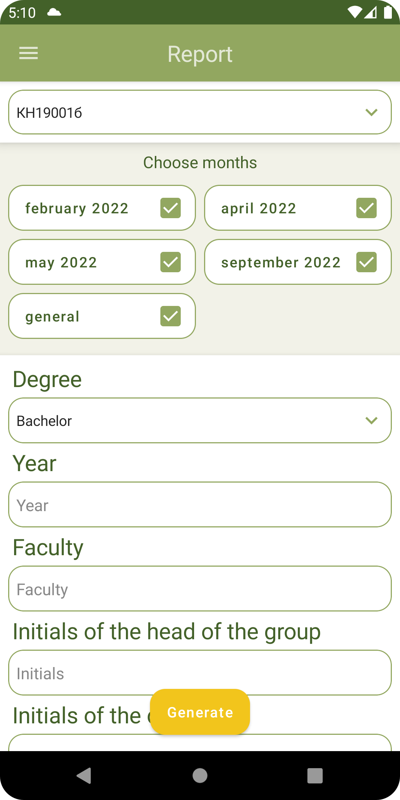
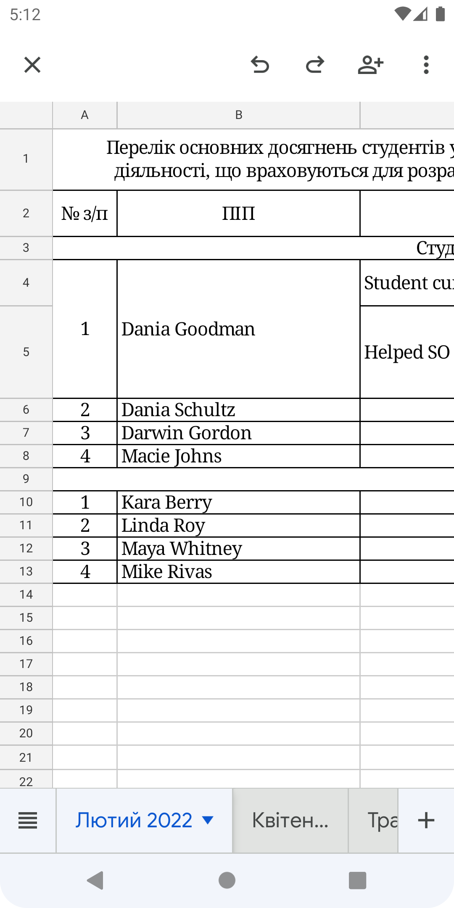

# NULES. Additional points
The app that helps with management of additional points of NULES students. Save, sum up and generate an Excel reprort in one click.

[](LICENSE)
## Features
- Saving groups of students
- Saving student activities for the students
- Generating an Excel report

## Overview
### Group screen



### Student screen

     

### Report screen
      

### Info screen

img src="Screenshots/eng/phone/InfoEng.png" width="300" height="585">

## Technologies used to make an app
- [Kotlin](https://kotlinlang.org/)
- [Jetpack Compose](https://developer.android.com/jetpack/compose)
- [Compose Navigation](https://developer.android.com/jetpack/compose/navigation)
- MVVM Architecture
- [Dagger-hilt](https://dagger.dev/hilt/) for dependency injection
- [Room](https://developer.android.com/training/data-storage/room) database for storing notes and tasks
- [Data store](https://developer.android.com/topic/libraries/architecture/datastore) for saving preferences

## License
```
MIT License

Copyright (c) 2022 bogdan801

Permission is hereby granted, free of charge, to any person obtaining a copy
of this software and associated documentation files (the "Software"), to deal
in the Software without restriction, including without limitation the rights
to use, copy, modify, merge, publish, distribute, sublicense, and/or sell
copies of the Software, and to permit persons to whom the Software is
furnished to do so, subject to the following conditions:

The above copyright notice and this permission notice shall be included in all
copies or substantial portions of the Software.

THE SOFTWARE IS PROVIDED "AS IS", WITHOUT WARRANTY OF ANY KIND, EXPRESS OR
IMPLIED, INCLUDING BUT NOT LIMITED TO THE WARRANTIES OF MERCHANTABILITY,
FITNESS FOR A PARTICULAR PURPOSE AND NONINFRINGEMENT. IN NO EVENT SHALL THE
AUTHORS OR COPYRIGHT HOLDERS BE LIABLE FOR ANY CLAIM, DAMAGES OR OTHER
LIABILITY, WHETHER IN AN ACTION OF CONTRACT, TORT OR OTHERWISE, ARISING FROM,
OUT OF OR IN CONNECTION WITH THE SOFTWARE OR THE USE OR OTHER DEALINGS IN THE
SOFTWARE.
```
